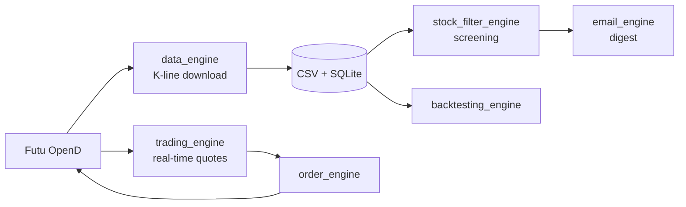

<a href="https://github.com/billpwchan"></a>

# futu_algo

An algorithmic trading framework for Hong Kong equities built on [Futu OpenD and Futu OpenAPI](https://openapi.futunn.com/). It covers the whole loop for a retail quant: download and store historical K-lines, screen the market, backtest a strategy, then run it live against your Futu account.

基於富途 OpenD / OpenAPI 的港股量化交易框架：數據下載與存儲、選股、回測、實盤交易，一個倉庫完成。

[](LICENSE)
[](https://github.com/billpwchan/futu_algo/stargazers)
[](https://openapi.futunn.com/)

## What it does

| Capability | Details |
|:--|:--|
| **Market data** | Downloads K-line history to CSV and SQLite: 1-minute bars for up to 2 years, daily bars for up to 10 years. Incremental updates resume from the last stored bar. |
| **Stock screening** | Composable filters (`Volume_Threshold`, `Price_Threshold`, `MA_Simple`, `Triple_Cross`) across HK and mainland China markets, with optional email digests. |
| **Strategies** | A small template (indicators, buy, sell) with `MACD_Cross`, `KDJ_Cross`, `RSI_Threshold` and `EMA_Ribbon` included. Each stock in the pool can run its own strategy. |
| **Backtesting** | Replays stored history through the same strategy classes, with a Pyfolio-based summary. |
| **Live trading** | Subscribes to real-time quotes and decides orders in about 0.01 s per stock for a three-indicator strategy (MACD, KDJ, close). Supports `SIMULATE` and `REAL` trading environments. |

## How it fits together



## Quick start

1. **Install and log in to [Futu OpenD](https://www.futunn.com/download/OpenAPI)** (Windows, macOS, CentOS, Ubuntu). You need at least LV1 quote rights for the markets you trade; see the [quote permission guide](https://openapi.futunn.com/futu-api-doc/qa/quote.html).
2. **Create the environment:**
   ```bash
   conda env create -f environment.yml
   ```
3. **Create `config.ini`** in the repository root (full template below).
4. **Download data:**
   ```bash
   python main_backend.py --force_update
   ```

<details>
<summary><b>config.ini template</b></summary>

```ini
[FutuOpenD.Config]
Host = <OpenD Host>
Port = <OpenD Port>
WebSocketPort = <OpenD WebSocketPort>
WebSocketKey = <OpenD WebSocketKey>
TrdEnv = <SIMULATE or REAL>

[FutuOpenD.Credential]
Username = <Futu Login Username>
Password_md5 = <Futu Login Password Md5 Value>

[FutuOpenD.DataFormat]
HistoryDataFormat = ["code","time_key","open","close","high","low","pe_ratio","turnover_rate","volume","turnover","change_rate","last_close"]
SubscribedDataFormat = None

[TradePreference]
LotSizeMultiplier = <# of Stocks to Buy per Signal>
MaxPercPerAsset = <Maximum % of Capital Allocated per Asset>
StockList = <Subscribed Stocks in List Format>

[Backtesting.Commission.HK]
FixedCharge = <Fixed Transaction Fee and Tax in HKD - 15.5>
PercCharge = <Percentage Transaction Fee in % - 0.1097>

[Email]
Port = <Server SMTP Setting>
SmtpServer = <Server SMTP Setting>
Sender = <Sender Email Address - account1@example.com>
Login = <Sender Email Address - account1@example.com>
Password = <Sender Email Password>
SubscriptionList = ["account1@example.com", "account2@example.com"]

[TuShare.Credential]
token = <TuShare API Token>
```

The format may change between commits; if an exception mentions a missing key, compare against this template.
</details>

## Command-line usage

| Task | Command |
|:--|:--|
| Update K-line data before the open (resumes, never overwrites) | `python main_backend.py --update` |
| Rebuild all data from scratch (slow, use with care) | `python main_backend.py --force_update` |
| Trade live with a strategy on 1-minute bars | `python main_backend.py --strategy MACD_Cross` |
| Trade on daily bars | `python main_backend.py --strategy MACD_Cross --time_interval K_DAY` |
| Trade the top 30 HSI constituents when no stock list is configured | `python main_backend.py --strategy MACD_Cross --include_hsi --time_interval K_DAY` |
| Backtest a strategy | `python main_backend.py --backtesting MACD_Cross` |
| Screen HK and China A-shares and email the result | `python main_backend.py --filter Volume_Threshold Price_Threshold --email_name MACD_Cross_Technique --market HK CHINA` |

Supported intervals: `K_1M`, `K_3M`, `K_5M`, `K_15M`, `K_30M`, `K_60M`, `K_DAY`, `K_WEEK`, `K_MON`, `K_QUARTER`, `K_YEAR`.

## Writing a strategy

Add a file to `strategies/` that subclasses the base class in `strategies/Strategies.py`, compute your indicators, and implement the buy and sell rules. The file name becomes the value you pass to `--strategy` and `--backtesting`. `MACD_Cross.py` is the shortest complete example.

## Project status

The core loop (data, screening, backtesting, live trading) is stable and used by the community around Futu OpenAPI. The PyQt GUI (`python main.py`) is unfinished. Active development of the trading stack continues in the sibling projects below.

## Part of a three-repo trading stack

**[futu_tick_downloader](https://github.com/billpwchan/futu_tick_downloader)** (tick capture) → **[strategy_powerbacktest](https://github.com/billpwchan/strategy_powerbacktest)** (backtesting) → **futu_algo** (live trading)

Built by [Bill Chan](https://github.com/billpwchan). If it saves you time, you can [buy me a coffee](https://www.buymeacoffee.com/billpwchan98).

<details>
<summary><b>Disclaimer</b></summary>

Futures, stocks and options trading involves substantial risk of loss and is not suitable for every investor. The
valuation of futures, stocks and options may fluctuate, and, as a result, clients may lose more than their original
investment. The impact of seasonal and geopolitical events is already factored into market prices. The highly leveraged
nature of futures trading means that small market movements will have a great impact on your trading account and this
can work against you, leading to large losses or can work for you, leading to large gains.

If the market moves against you, you may sustain a total loss greater than the amount you deposited into your account.
You are responsible for all the risks and financial resources you use and for the chosen trading system. You should not
engage in trading unless you fully understand the nature of the transactions you are entering into and the extent of
your exposure to loss. If you do not fully understand these risks you must seek independent advice from your financial
advisor.

All trading strategies are used at your own risk.

Any content in this repository should not be relied upon as advice or construed as providing recommendations of any
kind. It is your responsibility to confirm and decide which trades to make. Trade only with risk capital; that is, trade
with money that, if lost, will not adversely impact your lifestyle and your ability to meet your financial obligations.
Past results are no indication of future performance. In no event should the content of this correspondence be construed
as an express or implied promise or guarantee.

This repository and its author are not responsible for any losses incurred as a result of using any of our trading
strategies. Loss-limiting strategies such as stop loss orders may not be effective because market conditions or
technological issues may make it impossible to execute such orders. Likewise, strategies using combinations of options
and/or futures positions such as “spread” or “straddle” trades may be just as risky as simple long and short positions.
Information provided in this correspondence is intended solely for informational purposes and is obtained from sources
believed to be reliable. Information is in no way guaranteed. No guarantee of any kind is implied or possible where
projections of future conditions are attempted.
</details>
