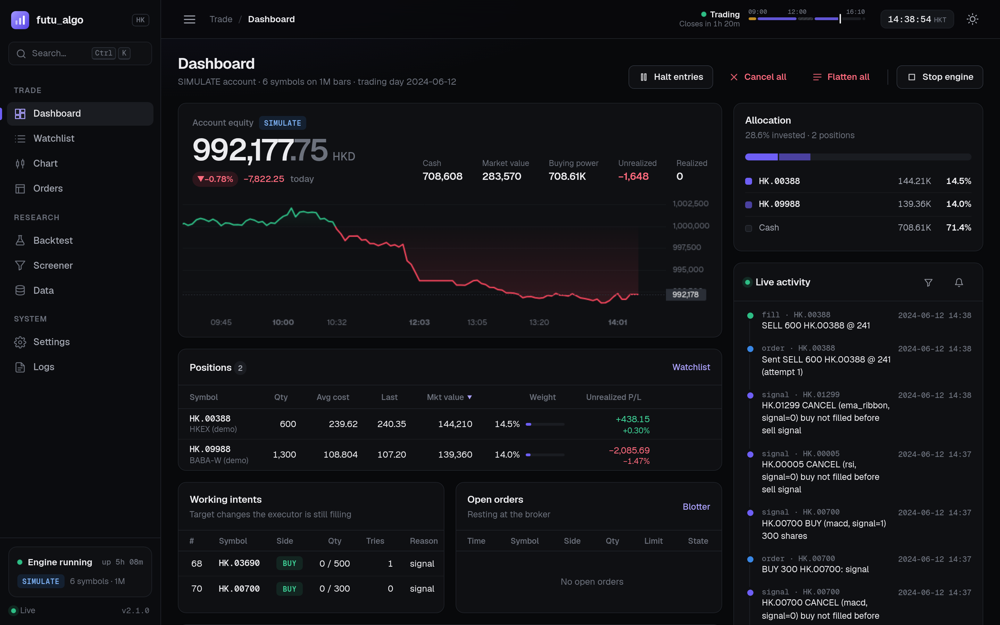
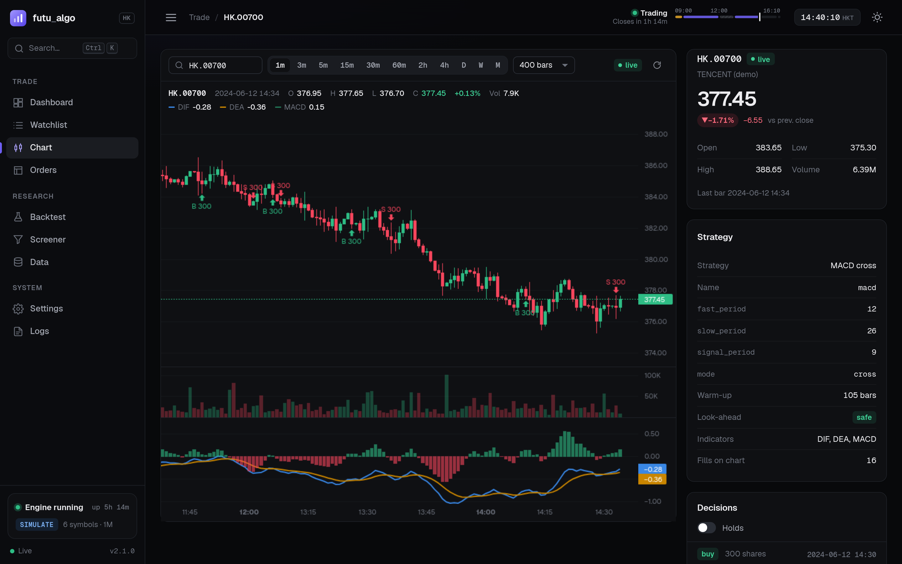
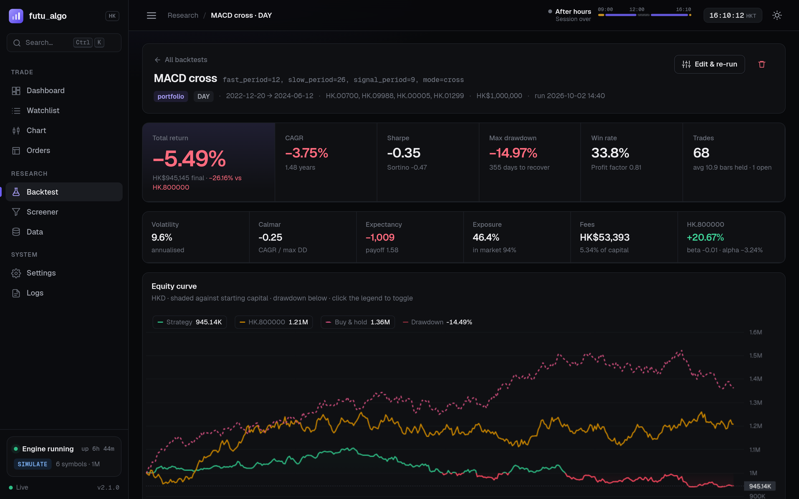
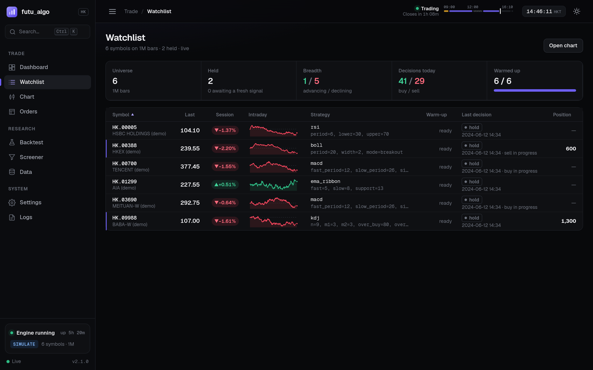
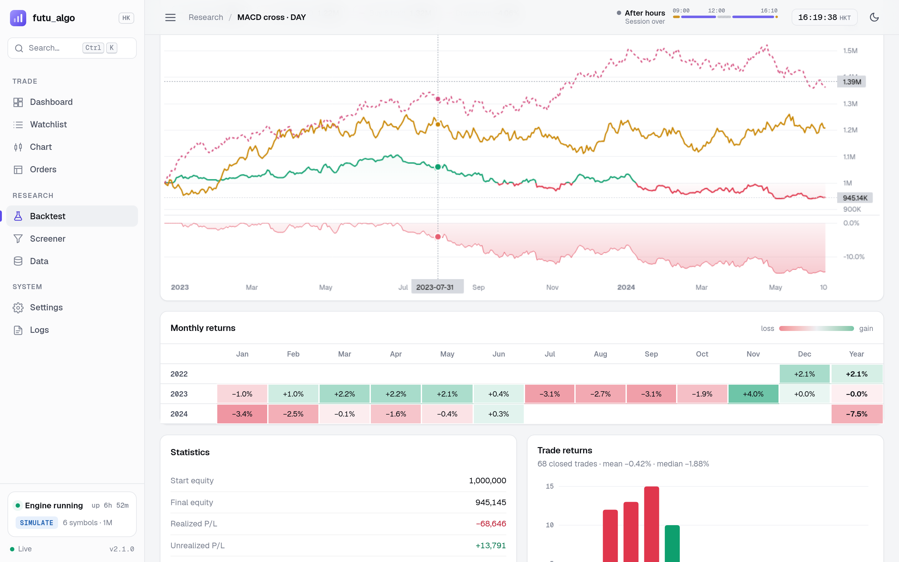

<a href="https://github.com/billpwchan/billpwchan"></a>

# futu_algo

Algorithmic trading for Hong Kong equities on [Futu OpenAPI](https://openapi.futunn.com/): a
local data cache, TDX-style strategies, a cost-accurate backtester, a stock screener and a
paper-trading engine that trades exactly what the backtest traded, all driven from a web
console or the command line.

基於富途 OpenAPI 的港股量化交易系統：本地 K 線快取、通達信風格策略、按港股真實費用計算的回測、
富途伺服器端選股，以及與回測逐筆一致的模擬盤實盤引擎，透過網頁控制台或命令列操作。

[](LICENSE)
[](pyproject.toml)
[](.github/workflows/ci.yml)



## What it does

| | |
|:--|:--|
| **Data** | Downloads Futu K-lines into a Parquet cache, paging past 1,000-bar pages, within Futu's rate limits and history quota. Any minute multiple (10M, 2H, 4H) is built session by session, never across the lunch break. |
| **Strategies** | `macd`, `kdj`, `rsi`, `ma_cross`, `ema_ribbon`, `boll`, `donchian`, on TDX-exact indicators. Write your own in a few lines; every backtest checks it for future functions. |
| **Backtesting** | Next-open fills in whole board lots, HK stamp duty and levies on the schedule in force each day, HKEX tick-table slippage, stops and targets, portfolio or per-symbol mode, benchmark against the Hang Seng Index. |
| **Paper trading** | Runs on live one-minute (or any) bars pushed by OpenD, sends tick-rounded limit orders to your Futu paper account, re-prices unfilled orders, reconciles fills, enforces risk limits and survives restarts. |
| **Screener** | Price, liquidity, valuation, financial and chart-pattern filters run on Futu's servers over the whole HK market without using history quota, optionally confirmed by a strategy. |
| **Notifications** | Email and Telegram for fills, rejections, errors, risk events, the daily summary and screener results. |
| **Web console** | A dark-first trading workstation: live dashboard, quote-board watchlist, charts with indicators and fills, backtest builder and tear-sheet reports, screener, order blotter, data cache, config editor and event log, with a command palette and keyboard shortcuts. |

<table>
<tr>
<td></td>
<td></td>
</tr>
<tr>
<td></td>
<td></td>
</tr>
</table>

The live engine and the backtester share the same strategy code and entry rules. The test suite
replays real one-minute bars through both and requires every fill, fee and the final equity to
match exactly.

## Quick start

Requirements: Python 3.11+, and for real market data [Futu OpenD](https://www.futunn.com/download/OpenAPI)
running and logged in, with quote rights for HK stocks (LV1 or above).

```bash
git clone https://github.com/billpwchan/futu_algo.git
cd futu_algo
python -m venv .venv && source .venv/bin/activate      # Windows: .venv\Scripts\activate
pip install -e .

futu-algo web --demo --speed 30      # try everything on a simulated OpenD, no account needed
```

Open http://127.0.0.1:8765/. Demo mode runs a synthetic market with a virtual clock inside the HK
session; the engine starts automatically and trades six made-up stocks on one-minute bars.

With OpenD:

```bash
futu-algo init config.yaml           # commented starter config + .env.example
futu-algo check -c config.yaml       # validates the config, OpenD, quota and the paper account
futu-algo backtest -c config.yaml    # downloads data once, prints a summary, saves a report
futu-algo web -c config.yaml         # console; start the engine from the dashboard
```

## The console

The console is a single-page app served by the same process, with no build step and nothing
loaded from the internet: fonts ([Geist](https://vercel.com/font), OFL) and the chart library
([Lightweight Charts](https://github.com/tradingview/lightweight-charts), Apache 2.0) ship in
the package, and a strict Content-Security-Policy allows only same-origin scripts.

- **Dashboard**: account equity with today's P/L and the intraday equity curve, allocation,
  positions with weights, working intents, open orders, fills and a live event timeline. Engine
  controls (start, halt entries, cancel all, flatten, stop) sit in the page header.
- **Watchlist**: a quote board of the trading universe with session change, an intraday
  sparkline, each symbol's strategy, warm-up progress, last decision and position.
- **Chart**: candles, volume and the strategy's own indicator lines with buy/sell fills, updated
  on every bar, beside a quote panel and the engine's recorded decisions.
- **Backtest**: a stepped builder (strategy, universe, period, sizing, execution and exits,
  checks) and a tear-sheet report: headline metrics, equity versus benchmark and buy & hold with
  drawdown, monthly returns, the distribution of trade returns, drawdown periods and every trade.
- **Screener**, **Orders**, **Data**, **Settings** and **Logs** cover presets and results, the
  blotter, the bar cache and history quota, the YAML config editor with validation, and the
  event log.

The top bar shows the HK session as a timeline (auction, morning, lunch, afternoon, closing
auction) with the time to the close. Press <kbd>Ctrl</kbd>/<kbd>⌘</kbd>+<kbd>K</kbd> (or
<kbd>/</kbd>) for the command palette, which jumps to pages and symbols and runs engine actions;
<kbd>G</kbd> then a letter switches page, <kbd>T</kbd> toggles the theme and <kbd>?</kbd> lists
the shortcuts. Dark is the default; light, follow-the-system and red-up/green-down colouring are
in Settings. Every page works down to phone width.

## Commands

| Command | What it does |
|:--|:--|
| `futu-algo web -c config.yaml [--engine]` | Web console; `--engine` also starts paper trading |
| `futu-algo web --demo [--speed 30]` | Console on a simulated OpenD and synthetic market |
| `futu-algo trade -c config.yaml [--dry-run]` | Headless paper trading; `--dry-run` fills locally and sends nothing to Futu |
| `futu-algo backtest -c config.yaml -s rsi -p period=9 --symbols HK.00700 HK.09988` | Backtest; flags override the config |
| `futu-algo replay -c config.yaml --start 2026-09-01` | Replay cached bars through the live engine to preview what it would have done |
| `futu-algo screen -c config.yaml -p liquid_uptrend [--notify]` | Run a screener preset |
| `futu-algo data fetch\|list\|quota -c config.yaml` | Manage the bar cache and check the history quota |
| `futu-algo strategies [--json]` | Strategies and their parameters |
| `futu-algo account\|positions\|orders -c config.yaml` | Inspect the Futu account |
| `futu-algo cancel-all\|flatten -c config.yaml` | Emergency controls |

Any config value can be overridden on the command line with `--set trading.timeframe=5M`.

## Configuration

Everything lives in one YAML file; `futu-algo init` writes a fully commented one
([example](src/futu_algo/example_config.yaml)). Relative paths are resolved against the
config's directory. Secrets are never stored in it: fields ending in `_env` name environment
variables, and a `.env` file next to the config is loaded automatically.

```yaml
trading:
  env: SIMULATE            # Futu paper account
  mode: paper              # or dry_run: local fills, nothing sent to Futu
  timeframe: 1M
  strategy: {name: macd}
  universe:
    - HK.00700
    - symbol: HK.09988
      strategy: {name: kdj, params: {over_sell: 25}}
  sizing: {method: fixed_value, value: 50000, max_positions: 5}
  risk: {max_daily_loss_pct: 0.03, max_position_value: 200000}
```

Paper trading (`SIMULATE`) is the supported environment. `REAL` is implemented but gated: it
needs `trading.allow_real: true` **and** `FUTU_ALGO_ALLOW_REAL=1` in the environment.

## Writing a strategy

A strategy returns indicator columns and a signal per bar: `1` = be long, `0` = be flat,
`NaN` = no change. TDX functions keep TDX semantics, so formulas port line by line.

```python
import pandas as pd
from pydantic import Field
from futu_algo.indicators import CROSS, LLV, MA, REF
from futu_algo.strategy import Strategy, StrategyParams, events


class Params(StrategyParams):
    fast: int = Field(20, ge=2)
    slow: int = Field(60, ge=3)


class PullbackTrend(Strategy):
    name = "pullback_trend"
    title = "MA trend with pullback entry"
    Params = Params

    def warmup_bars(self) -> int:
        return self.params.slow

    def indicators(self, bars: pd.DataFrame) -> pd.DataFrame:
        c = bars["close"]
        return pd.DataFrame(
            {"fast": MA(c, self.params.fast), "slow": MA(c, self.params.slow), "low20": LLV(bars["low"], 20)},
            index=bars.index,
        )

    def signals(self, bars, ind):
        buy = CROSS(ind["fast"], ind["slow"]) & (bars["close"] > REF(ind["low20"], 1) * 1.05)
        return events(buy, CROSS(ind["slow"], ind["fast"]))
```

Put the file in a folder listed under `strategy_paths` and use `name: pullback_trend` in the
config. The same class runs in backtests, replays and live trading.

## Deployment

Linux with systemd: [`deploy/systemd/futu-opend.service`](deploy/systemd/futu-opend.service)
runs the command-line OpenD and [`deploy/systemd/futu-algo.service`](deploy/systemd/futu-algo.service)
runs the console and engine. A [`Dockerfile`](Dockerfile) is included for running futu_algo
next to an OpenD instance. If OpenD is on another machine, it requires an RSA key
(`futu.rsa_private_key`) for trading, and the console needs `FUTU_ALGO_WEB_TOKEN` before it will
listen on a non-local address.

## Development

```bash
pip install -e ".[dev]"
pytest -m "not e2e"         # unit, integration and parity tests
ruff check . && mypy
pip install -e ".[e2e]" && pytest -m e2e    # browser tests of the console (Chromium)
```

[docs/ARCHITECTURE.md](docs/ARCHITECTURE.md) explains the design, the timing model and the
known limitations. [CHANGELOG.md](CHANGELOG.md) records why 1.x was replaced.

## Part of a three-repo trading stack

**[futu_tick_downloader](https://github.com/billpwchan/futu_tick_downloader)** (tick capture) ·
**[strategy_powerbacktest](https://github.com/billpwchan/strategy_powerbacktest)** (research
backtesting) · **futu_algo** (screening, backtesting and paper trading, standalone)

Built by [Bill Chan](https://github.com/billpwchan). Licensed under Apache 2.0. Charts use
[TradingView Lightweight Charts™](https://www.tradingview.com/lightweight-charts/) (Apache 2.0).

<details>
<summary><b>Disclaimer</b></summary>

For education and research. Trading stocks involves substantial risk of loss. Backtest and paper
trading results do not predict live performance. Nothing in this repository is investment
advice; the author takes no responsibility for trading results. Use at your own risk.
</details>
